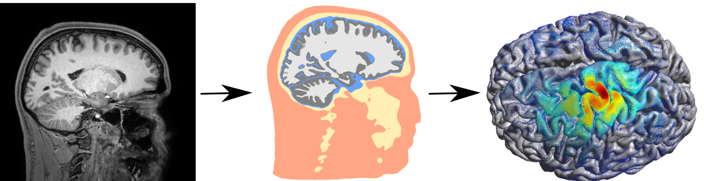

# SimNIBS

The main goal of SimNIBS is to calculate electric fields caused by Transcranial Electrical Stimulation (TES) and Transcranial Magnetic Stimulation (TMS).

The pipeline is divided in three parts:
1. Automatic segmentation of MRI images and meshing to create individualized head models
2. Calculation of electric fields through the Finite Element Method (FEM)
3. Post-processing of results for further analysis.

## Build Status
| Linux   | Windows    | MacOS |
|---------|------------|-----|
|  |  |     |

## Getting Started

SimNIBS runs on 64bit Windows, Linux and MacOS machines.
Please visit [the SimNIBS website](https://simnibs.github.io/simnibs/build/html/installation/simnibs_installer.html) for instructions on how to download and install SimNIBS.

## Authors
Please see [the SimNIBS website](./docs/contributors.rst) for a complete list of contributors.

## 3rd Party Files
We have included code or binaries from the following project to this repository:
* [Gmsh](www.gmsh.info)
* [meshfix](https://github.com/MarcoAttene/MeshFix-V2.1)
* [SPM12](https://www.fil.ion.ucl.ac.uk/spm/software/spm12/)
* [CAT12](http://www.neuro.uni-jena.de/cat/)
* [PETSc](https://www.mcs.anl.gov/petsc/)
* [HYPRE](https://github.com/hypre-space/hypre)
* [MPICH](https://www.mpich.org/)
* [MSMPI](https://github.com/Microsoft/Microsoft-MPI)
* [CYGWIN](https://www.cygwin.com/)
* [pygpc](https://github.com/konstantinweise/pygpc)
* [PyPardiso](https://github.com/haasad/PyPardisoProject)

For a full list of files and licenses, please see the [3RD-PARTY.md](3RD-PARTY.md) file
