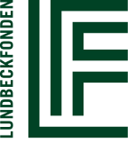

.. _contributors:

Contributors and Funding
=========================

Current Contributors
---------------------
* Axel Thielscher
   * Project coordination
   * Debugging and maintenance across the complete code.
   * Meshing part of :ref:`charm_docs` (4.0)
   * New TMS coil models (4.0)
   * :ref:`dwi2cond_docs` (2.1)
   * Example dataset *ernie* (2.1)

* Oula Puonti
   * Debugging and maintenance across the complete code.
   * Main author of :ref:`charm_docs` and of simnibs 4.0 in general (4.0)
   * New MNI head mesh (2.1)

* Kristoffer H. Madsen
   * Debugging and maintenance across the complete code.
   * Implementation of the tcd format and initial code for the flexible TMS optimization (4.5)
   * Added MUMPS support (4.5)
   * Cross-platform building (4.0)
   * New html-based viewer (4.0)
   * Ccd to nifti conversion (4.0)
   * New TMS coil models (4.0)
   * I/O function for Softaxic (4.0)
   * MNI transformation (2.1)
   * Fast I/O for gmsh-meshes in python (2.0)
   * Pre-calculated A-fields for TMS in the pipeline using nifti volume files (2.0)

* Jesper D. Nielsen
   * Update of installation procedure (4.5)
   * Debugging and deprecation removal (4.5)
   * Update to *charm* to optionally use FreeSurfer surfaces (4.1)
   * Added the possiblity to calculate EEG leadfields (4.1)
   * Contributions to the segmentation functions in :ref:`charm_docs` (4.0)
   * Main author of the *headreco* pipeline, now discontinued (2.1)

* Konstantin Weise
   * Implementation of flexible TES optimization (4.5)
   * Update of GPC code (4.5)
   * Integration of mmg to improve tetrahedral mesh quality (4.1)
   * First version of the TMS optimization (3.1)
   * UQ functionality (3.0)

* Thomas Knoesche
   * Help with the flexible TES optimization (4.5)
   * Help with the UQ functionality (3.0)

* Ole Numssen
   * I/O functions for Localite and Brainsight (4.0)
   * First version of the TMS optimization (3.1)
   
* Torge H. Worbs
   * Implementation of the tcd format and flexible TMS optimization (4.5)
   * Coil models for Brainsway H1, H4 and H7, and of MagVenture MST Twin coil (4.5)
   * Region-of-interest class (4.5)
   * Help with the flexible TES optimization (4.5)
   * Integration of mmg to improve tetrahedral mesh quality (4.1)

* Bianka Rumi
   * Coil models for Brainsway H1, H4 and H7 (4.5)
   * Testing and debugging of the flexible TMS optimization (4.5)

* Merle Diedrichsen
   * Update of electrode meshing to improve tetrahedral quality at the electrode edges (4.1)

* Sybren Van Hoornweder
   * Main contributor to the Ernie Extended dataset

* Kathleen E. Mantell
   * Main contributor to the NHP dataset

* Alex Opitz
   * Implementation of first diffusion-to-conductivity mapping approach
   * Co-contributor to many other parts in SimNIBS 1.0
   * Testing and validation of the new FEM calculations for tDCS in SimNIBS 2.0
   * Contribution to the NHP dataset

Former Contributors
---------------------

* Maria Drakaki
   * Main contributor to the new TMS coil models (4.0)

* Fang Cao
   * Code testing and updating to python 3.9 (4.0)

* Guilherme B. Saturnino
   * Main contributor to many SimNIBS features: 
	   * TES optimiaztion algorithms (3.1, 3.2)
	   * Installation procedure (3.0, 3.2)
	   * Documentation (3.0, 3.1 and 3.2)
	   * Fast FEM code (3.0)
	   * (together with K. Weise) UQ functionality (3.0)
	   * New python core (2.1)
	   * GUI (2.0)
	   * Electrode modeling for TES (2.0)
	   * Bug-fixing
	   * Meshing part of :ref:`charm_docs` (4.0)

* Hassan Yazdanian and Kim Knudsen
   * Magnetic Field Calculations (3.2)

* Luis J. Gomez, Moritz Dannhauer, and Angel V. Peterchev; Duke University, Durham, North Carolina, U.S.A.
   * Auxiliary Dipole Method (ADM) TMS optimization (3.2)

* Andre Antunes
   * Main contributor to the FEM pipeline in SimNIBS 2.0
   * Implementation of a range of post-processing programs in SimNIBS 2.0
   
* Andreas Bungert
   * Testing of the new FEM pipeline in SimNIBS 2.0

* Mirko Windhoff
   * Main contributor to SimNIBS 1.0

Funding Sources
-----------------

We would like to cordially thank our funders

.. centered::  |lundbeck|_ |novo|_ |sdc|_ |stiped|_ |if|_ |nimh|_ |danishcancersociety|_

Institutions
---------------

* Versions 2.1, 3 and 4 have been developed at the `Danish Research Center for Magnetic Resonance <http://www.drcmr.dk>`_ (Copenhagen, Denmark) and the `Technical University of Denmark <http://www.dtu.dk/english>`_ (Kgs Lyngby, Denmark), in collaboration with external partners.
* Version 1.0 was created at the `Max-Planck Institute for Biological Cybernetics <http://www.kyb.tuebingen.mpg.de>`_ (Tübingen, Germany).
* Version 2.0 was developed in all three institutions

.. _lundbeck: https://www.lundbeckfonden.com/en/

.. |novo| image:: ./images/novonordiskfonden.png
   :height: 50
.. _novo: https://novonordiskfonden.dk/en/

.. |sdc| image:: ./images/sdc.png
   :height: 50
.. _sdc: http://sdc.university/

.. |stiped| image:: ./images/stiped.png
   :height: 50
.. _stiped: https://evkb.de/kliniken-zentren/kinder-jugendliche/kinder-und-jugendpsychiatrie/forschung/stiped-stimulation-in-pediatrics-stimulation-bei-kindern/

.. _if: https://innovationsfonden.dk/en

.. |nimh| image:: ./images/NIH-NIMH-logo-new.png
   :height: 50
.. _nimh: https://www.nimh.nih.gov/index.shtml

.. _danishcancersociety: https://www.cancer.dk/
