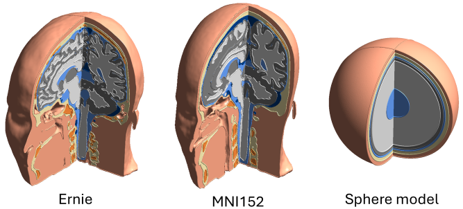
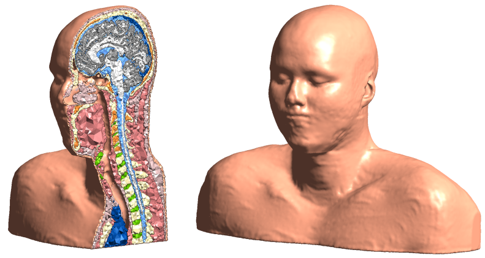

.. _dataset:

Datasets
================

Example Dataset
----------------------

The SimNIBS example dataset contains head models for example subject "ernie" and for the MNI152 head, and a spherical head model. `Click here  to download <https://github.com/simnibs/example-dataset/releases/latest/download/simnibs4_examples.zip>`_

! Note: Previous versions of the example dataset are incompatible with SimNIBS4 !

Ernie Extended
--------------------

   
Ernie Extended is an MRI- and CT-derived head model for simulations of extracephalic transcranial electrical stimulation (tES). `Click here  to download <https://osf.io/6qv2z>`_

.. note::

  When using this dataset in a publication, please cite

  Van Hoornweder, S., Cappozzo V., De Herde, L., Puonti, O., Siebner H. R., Meesen, L. J. R., Thielscher, A.,  Head And Shoulders: The Impact Of An Extended Head Model On Transcranial Electric Stimulation Simulation And Optimization

  The dataset is shared under the CC BY-NC 4.0 license
  
