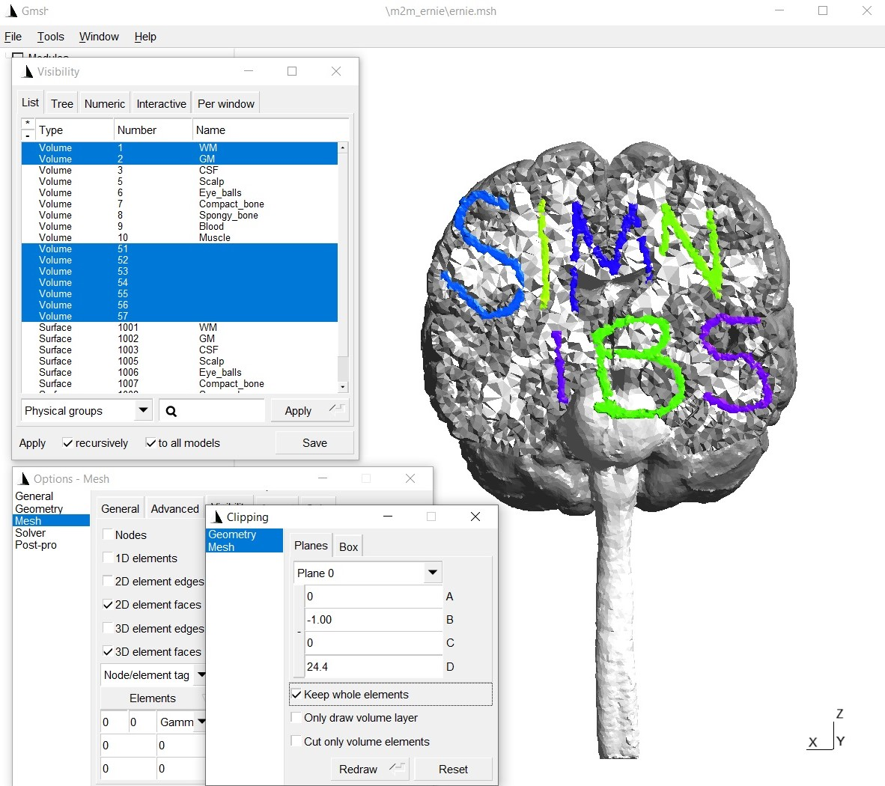

.. _add_tissues_to_upsampled_doc:

add_tissues_to_upsampled
===========================

Description
------------

Adds extra tissues from an existing tissue label file to tissue_labeling_upsampled.nii.gz. The tissues to-be-added need to be in a NIfTI-file, which is in the same space as the T1-weighted scan that was used as input to *charm*.

Usage example
-------------
1. Download an example extra tissue file :download:`here <../../data/simnibs.nii.gz>`. The mask contains the letter "SIMNIBS" (each letter has a different label from 1 to 7), as can be seen when, e.g. overlaying the mask on the original T1-weighted image:

.. image:: ../../images/custom_mask1.jpg
   :align: center
   :scale: 50 %

\

2. Move the nifti file into the m2m-folder of the "Ernie" example data set (i.e., `m2m_ernie`).

3. Open a terminal and go to `m2m_ernie` in the example data set.

4. Make a copy of the *tissue_labeling_upsampled.nii.gz* (e.g., tissue_labeling_upsampled_orig.nii.gz) that is found in the sub-folder *label_prep*.

5. Run

.. code-block:: bash

  add_tissues_to_upsampled -i simnibs.nii.gz -t ./label_prep/tissue_labeling_upsampled.nii.gz -o ./label_prep/tissue_labeling_upsampled.nii.gz --offset 50

The new *tissue_labeling_upsampled.nii.gz* file will include the extra labels from label number 51 to label number 57. That is, the offset value is added to the label values inside the extra tissue volume.

.. image:: ../../images/custom_mask2.jpg
   :align: center
   :scale: 50 %

\

6. Now recreate the head model by running

.. code-block:: bash

	cd ..
	charm ernie --mesh

7. The updated head mesh can be checked by visualizing it in gmsh:

\

8. Run simulations: We have to define the conductivities of the new tissue labels:

* *Python*

  .. code-block:: python

	from simnibs import sim_struct, run_simnibs

	S = sim_struct.SESSION()
	S.subpath = 'm2m_ernie'
	S.pathfem = 'simu'
	S.fields = 'eEjJ'  # save e-field and current density

	# add a TDCS simulation
	tdcs = S.add_tdcslist()
	tdcs.currents = [0.001, -0.001]  # Current flow though each channel (A)

	# The new tissues were added using label numbers 51 to 57.
	# We need to assign a conductivity to each tissue label.
	# Note: Python indexing starts with 0, thus the conductivities have
	#       to be assigned starting from index 50 of the conductivity list
	tdcs.cond[50].value = 10 # [S/m]
	tdcs.cond[50].name = 'S'
	tdcs.cond[51].value = 0.01 # [S/m]
	tdcs.cond[51].name = 'I'
	tdcs.cond[52].value = 10 # [S/m]
	tdcs.cond[52].name = 'M'
	tdcs.cond[53].value = 0.01 # [S/m]
	tdcs.cond[53].name = 'N'
	tdcs.cond[54].value = 10 # [S/m]
	tdcs.cond[54].name = 'I2'
	tdcs.cond[55].value = 0.01 # [S/m]
	tdcs.cond[55].name = 'B'
	tdcs.cond[56].value = 10 # [S/m]
	tdcs.cond[56].name = 'S2'

	electrode1 = tdcs.add_electrode()
	electrode1.channelnr = 1
	electrode1.centre = 'FC5'
	electrode1.shape = 'ellipse'
	electrode1.dimensions = [50, 50]
	electrode1.thickness = 4

	electrode2 = tdcs.add_electrode()
	electrode2.channelnr = 2
	electrode2.centre = 'FC6'
	electrode2.shape = 'ellipse'
	electrode2.dimensions = [50, 50]
	electrode2.thickness = 4

	# Run simulation
	run_simnibs(S)

* *MATLAB*

  .. code-block:: matlab

	S = sim_struct('SESSION');
	S.subpath = 'm2m_ernie';
	S.pathfem = 'simu';
	S.fields = 'eEjJ'; % save e-field and current density

	% add a TDCS simulation
	S.poslist{1} = sim_struct('TDCSLIST');
	S.poslist{1}.currents = [1e-3, -1e-3]; % Current going through each channel, in Ampere

	% The new tissues were added using label numbers 51 to 57.
	% We need to assign a conductivity to each tissue label.
	S.poslist{1}.cond(51).value = 10; % in S/m
	S.poslist{1}.cond(51).name = 'S';
	S.poslist{1}.cond(52).value = 0.01; % in S/m
	S.poslist{1}.cond(52).name = 'I';
	S.poslist{1}.cond(53).value = 10; % in S/m
	S.poslist{1}.cond(53).name = 'M';
	S.poslist{1}.cond(54).value = 0.01; % in S/m
	S.poslist{1}.cond(54).name = 'N';
	S.poslist{1}.cond(55).value = 10; % in S/m
	S.poslist{1}.cond(55).name = 'I2';
	S.poslist{1}.cond(56).value = 0.01; % in S/m
	S.poslist{1}.cond(56).name = 'B';
	S.poslist{1}.cond(57).value = 10; % in S/m
	S.poslist{1}.cond(57).name = 'S2';

	% define first electrode
	S.poslist{1}.electrode(1).channelnr = 1;
	S.poslist{1}.electrode(1).centre = 'FC5';
	S.poslist{1}.electrode(1).shape = 'ellipse';
	S.poslist{1}.electrode(1).dimensions = [50, 50];
	S.poslist{1}.electrode(1).thickness = 4;

	% define second electrode
	S.poslist{1}.electrode(2).channelnr = 2;
	S.poslist{1}.electrode(2).centre = 'FC6';
	S.poslist{1}.electrode(2).shape = 'ellipse';
	S.poslist{1}.electrode(2).dimensions = [50, 50];
	S.poslist{1}.electrode(2).thickness = 4;

	% Run simulation
	run_simnibs(S)

The simulation results with the new tissues:

.. image:: ../../images/custom_mask4.jpg
   :align: center
   :scale: 40 %

Further notes
---------------

* Type :code:`add_tissues_to_upsampled -h` for more information and options
* Please see :ref:`fixheadmodel_tutorial` for a related example

