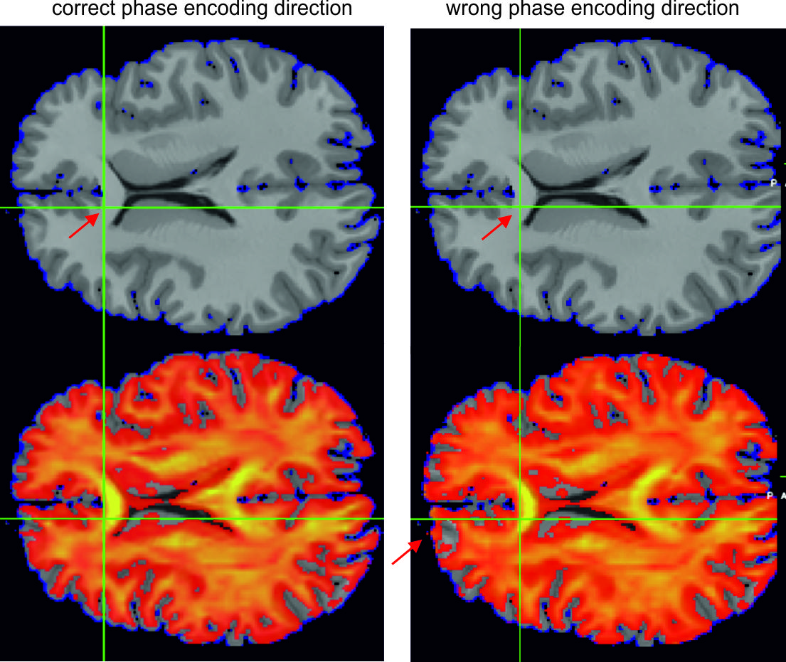

.. _dwi2cond_docs:

dwi2cond
=========

Description
------------

This optional tool prepares diffusion tensors for GM and WM from diffusion MRI (dMRI) data. The prepared tensors can then be used by SimNIBS to estimate anisotropic conductivities for GM and WM during the FEM calculations. Only single shell data (i.e., with a single b-value in addition to some b=0 images) with a single phase encoding direction for the EPI readout is supported. For other data, a preprocessed DTI tensor can be used as input to dwi2cond instead. All processing steps are based on FSL tools.

.. attention:: dwi2cond depends on `FSL <https://fsl.fmrib.ox.ac.uk/fsl/fslwiki>`_ (5.0.5 or newer), and is therefore *not* compatible with Windows. Please see :ref:`optional_deps` for instructions on how to set up FSL.

Usage example
--------------
This example uses FSL eddy and FSL topup for eddy current correction and static distortion correction.

1. Open a terminal and go to the directory of the “Ernie” example data set.
2. Run:

.. code-block:: text

   dwi2cond --all --eddy --phasedir=-y --readout=0.05 ernie org/ernie_dMRI.nii.gz org/ernie_dMRI.bval org/ernie_dMRI.bvec org/ernie_dMRI_rev.nii.gz

\

  The argument :code:`--all` tells dwi2cond to preprocess the diffusion MRI data, reconstruct the diffusion tensors, and register the tensors to the T1 of the subject. Preprocessing encompasses correction for subject motion and eddy-current-induced image distortions and, optionally, correction for static image distortions.

  Setting :code:`--eddy` will prompt dwi2cond to use FSL eddy for motion and eddy-current correction. In this case, also the phase encoding direction of the dMRI sequence and its readout time (in [s]) has to be stated using :code:`--phasedir` and :code:`--readout`. Please refer to the description of FSL eddy on the FSL homepage for further information about these parameters.

  The subject ID is provided as first parameter after the arguments, followed by the name of the diffusion dataset and the text files for the b-values and the b-vectors. Please refer to the description of FSL dtifit for details on the file conventions.

  A dataset of b=0 images acquired with reversed phase encoding direction is given as last parameter. In this case, FSL topup will be used for static distortion correction.

3. Check the results:

.. code-block:: text

   dwi2cond –check ernie

\

  Overall, three windows appear. The first shows the fractional anisotropy (FA) image superimposed on the structural T1 of the subject in fslview or fsleyes for visual control of the coregistration accuracy. In addition, the first eigenvectors can be seen when increasing their opacity and deselecting FA (subplot A below). When zooming in, their orientations can be checked. A second window shows the first eigenvectors exemplarily in a coronal slice of the head mesh (subplot B), again for visual control of their orientations in white matter. Please note that gray matter is close to isotropic, so that the eigenvectors can have rather arbitrary orientations there.
  
.. figure:: ../../images/dwi2cond_1.jpg
   :align: center
                        
   Visualization of first eigenvectors, useful to confirm that the directions of the vectors in white matter are correct **(A)** in FSLeyes, and **(B)** in gmsh. 

\ 
 
  In the third window, FA images determined from the dMRI data before and after preprocessing are shown to allow for controlling the effects of the preprocessing. These FA images are registered to the T1 using a rigid body (6DoF) transformation, so that spatial distortions remain visible, which is useful to confirm that the phase encoding directions (--phasedir or --udir options) were set correctly.
  

                        
   FA images for correct and incorrect --phasedir settings. For the latter, the position of the corpus callosum differs between the FA and T1 images.

\

  Also sum-of-squared-error (SSE) images of the tensor fitting procedure can be checked in the third window. The SSE images are in arbitrary units, but are helpful to check the effectiveness of the preprocessing steps (the brain gets more "red" in subplot A below, and the white rims in frontal gray matter get thinner) and to identify putative artifacts in the dMRI datam (subplot B below shows an example of insufficient fat suppression).
  
  .. figure:: ../../images/dwi2cond_2.jpg
   :align: center
                        
   SSE images **(A)** before and after eddy current correction and **(B)** for scans with insufficient fat suppression.

\ 

Further usages
----------------
1. "Standard" eddy current correction based on affine registrations:

  :code:`dwi2cond --all <subjectID> <dMRI_dataset> <bvalue_file> <bvector_file>`

2. Distortion correction based on fieldmap data:

  :code:`dwi2cond --all --dwidwell=<dwell_time_in_ms> --udir=<warping_direction> <subjectID> <dMRI_dataset> <bvalue_file> <bvector_file> <field_map_magnitude_image> <field_map_phase_image>`
  
  The argument :code:`--dwidwell` is used to specify the dwell-time (or echo-spacing) of the dMRI sequence in [ms]. The standard warping direction is set to “y-”, otherwise state it using :code:`--udir`. A standard Siemens gre fieldmap with a TE difference of 2.46 ms is assumed. For other fieldmaps, additional parameters have to be defined on the command line (see :code:`dwi2cond –help`).

3. Using a preprocessed DTI tensor:

  :code:`dwi2cond --all <subjectID> <DTI-tensor>`
  
  Dwi2cond will coregister the tensor image with the structural T1 of the subject for further use with SimNIBS.

Further notes
----------------
* dwi2cond uses a non-linear registration based on FSL fnirt to transform the diffusion tensors to the space of the structural T1 image. In case the distortion correction during preprocessing is good enough, 12 or 6 DoF affine registrations can be used instead (controlled by the argument :code:`–regmthd`).
* When something goes wrong, you can check the :file:`dwi2cond_log.html` which is saved in the :file:`m2m_<subID>/dMRI_prep` subdirectory.
* SimNIBS will use the coregistered diffusion tensors (stored in :file:`m2m_<subID>/DTI_coregT1_tensor.nii.gz`) to estimate conductivity tensors for GM and WM. The following mappings from diffusion to conductivity tensors are supported:
	* Direct mapping based on linear rescaling of the diffusion tensors (`Rullmann et al., 2009 <https://doi.org/10.1016/j.neuroimage.2008.09.009>`_; `Tuch et al., 2001 <https://doi.org/10.1073/pnas.171473898>`_).
	* Inhomogeneous, isotropic conductivities,  calculated as the mean conductivities of tensors of the direct mapping approach.
	* Volume normalized mapping (`Güllmar et al., 2010 <https://doi.org/10.1016/j.neuroimage.2010.02.014>`_) that keeps the geometric mean of the eigenvalues identical to the standard isotropic conductivity.
* SimNIBS ensures that all conductivity tensors are positive definite. This is done to ensure that the FEM solver will robustly converge. In addition, a maximal conductivity of 2 S/m and a maximal ratio of 10 between the largest and smallest conductivity eigenvalues is enforced to guarantee a realistic conductivity range. The latter values can be changed in the GUI or scripts.
