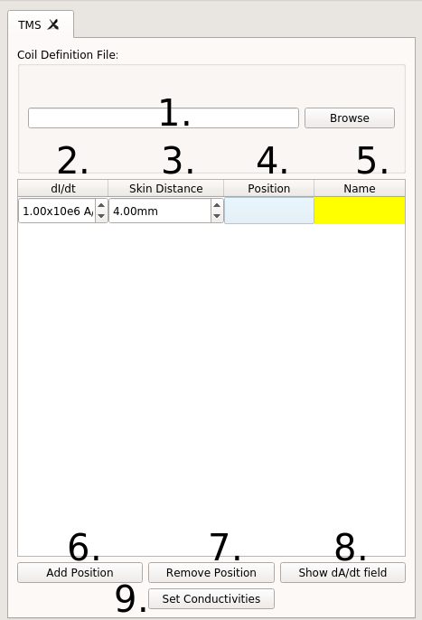
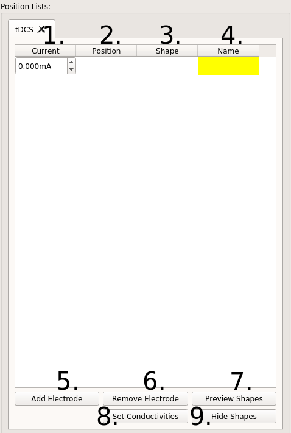
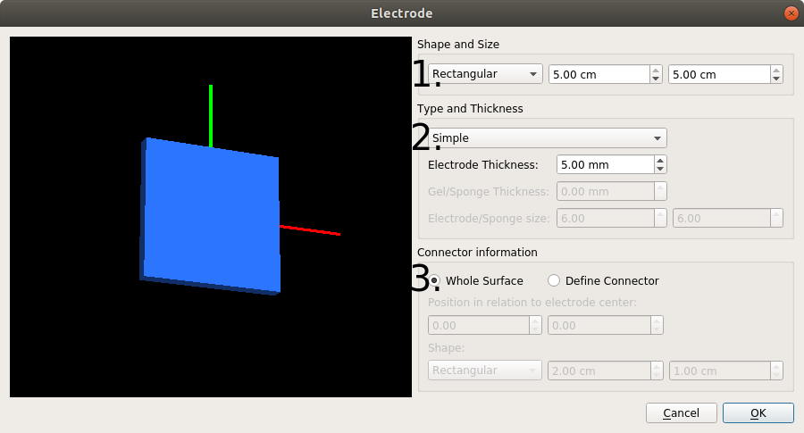

.. _gui_docs:

Graphical User Interface Documentation
=======================================

Main GUI
--------

.. image:: ../images/doc_guimain.png

1. Path to the *m2m_<subid>* folder, created during the head segmentation. It is filled out automatically if the Head Mesh (2) is correctly specified. For the *ernie* head model in the example dataset, it is :file:`simnibs_examples/ernie/m2m_ernie/`
2. Name of the head mesh file. It is filled out automatically if the m2m Folder is correctly specified. For the *ernie* head model, this is :file:`simnibs_examples/ernie/m2m_ernie/ernie.msh`
3. Folder where the simulations will be saved. Only one simulation can be stored per folder and SimNIBS will raise an error when it find results from another simulation already stored in this folder. A folder name is automatically created if either Head Mesh or m2m Folder are specified. For ernie, this would default to :file:`simnibs_examples/ernie/simnibs_simulation/`
4. The tabs are used to specify the details of the TMS and tDCS simulations.
5. Add a new tDCS **Poslist** to set up a tDCS simulation.
6. Adds a new TMS **Poslist** to set up a simulation with one ore more TMS coil positions.
7. Copy an existing **Poslist**. This is efficient when the aim is to vary only a few simulation parameters (e.g. electrode positions).
8. Run the simulations.
9. Select to view either the scalp surface or the gray matter surface.
10. Window for visualizing the 3D Head Model.

TMS Tab
--------

1. Name of the coil definition file. Clicking on *Browse* will bring you to the :file:`coil_models/` folder, where the SimNIBS coil files are stored.
2. Rate of change of the coil current *dI/dt*, in A/s. Usually, the maximal rate of change at the beginning of a pulse is used here. For example, this value is directly reported on the display of MagVenture stimulators.
3. Distance between the coil and the skin. A value of 4 mm is set as default, in order to roughly account for the additional distance caused by the hair. Please change in case more accurate information is available for your specific case.
4. Position and direction of the coil. Click twice to open a selection window and then click on the mesh to determine the position of the coil center and an additional position specifying the coil orientation. See the TMS tutorial for more information.
5. Name of the coil position (optional)
6. Adds a new coil position (that is, a new row) to the current **Poslist**
7. Removes a coil position to the current **Poslist**
8. Previews the current row *dA/dt* field in the head mesh. This only works for coil files with the ending *.nii.gz.*
9. Change the tissue conductivities for this TMS **Poslist** from the predefined standard conductivities.

tDCS Tab
--------

1. Current value through each electrode, in mA. Positive values for anodes, negative for cathodes. The currents of all electrodes have to add up to zero.
2. Electrode position and direction.  Click twice to open a selection window and then click on the mesh to define the electrode center and a further position for setting the electrode orientation. An (arbitrary) orientation has also to be set in case of round electrodes. See the tDCS Tutorial for more information.
3. Electrode shape. Click twice to open the window to define the electrode shape.
4. Name of Electrode (optional)
5. Add a new electrode
6. Remove the current electrode
7. Preview the electrode shapes in the mesh. The shapes are only an approximation as to how the electrode will look like.
8.  Change the conductivities for this tDCS simulation from the predefined standard values.
9. Hide the electrode shapes.

Position Window
----------------

.. image:: ../images/doc_guipos.png

1. Drop-down menu to select a position from an EEG cap
2. Coordinates of the TMS coil or tDCS electrode center
3. The status of this box determines which coordinates are set when clicking on the head model. Unchecked:  Position of the coil or electrode center; Checked: Reference position to determine the coil or electrode orientation.
4.  Coordinates of the reference position, used to determine the orientation of the electrode (tDCS) or coil (TMS). Specifically, the “y” axis is defined to be oriented according to the line from the center position to the reference position. Please note that the coil or electrode orientation relative to the scalp surface will be automatically determined (the “z” axis of the coil or electrode is automatically oriented to be orthogonal to the local scalp surface).
5. Projects the current position on the scalp. This can be used if, for example, you have a set of coordinates in the brain and want to find the closest positions on the scalp.

Electrode Window
-----------------

1. Dimensions and shape of the electrode. 

  * Rectangular: The values correspond to the sides of a rectangle
  * Elliptical: The values correspond to the diameters of the axes of an ellipse

2. Type of electrode.

  * Simple: Only a gel layer is modeled.
  * Electrode + Gel: A silicon rubber layer and a gel layer are modeled. The   thickness of each layer can be set independently.
  * Electrode + Sponge: A silicon rubber layer is modeled inside a sponge   soaked in a saline solution. The silicon rubber is placed in the middle of the   sponge. The dimensions of the sponge cannot be smaller than those of the   electrode.

  See `Saturnino et al. 2015 <https://doi.org/10.1016/j.neuroimage.2015.06.067>`_ for more details

3. Electrode connector (or plug). The user has a choice on whether or not to model the area where the  electrode is connected to the cable. If it is modeled, its position in relation  to the surface as well as its shape can be set.

Conductivities Window
----------------------

.. image:: ../images/doc_guicond.png

1. Name of tissue
2. Conductivity (in S/m)
3. Settings for anisotropic conductivities in gray and white matter, informed by diffusion MRI data. There are 4 options (see Opitz et al. 2011 for more information):

  * Scalar: Uses isotropic conductivities (standard setting, no diffusion MRI data required). An uniform value is assigned for each tissue.
  * Volume normalized: Uses tensor information to set the directional information of the tensors. The tensor volumes are set to match the volume of the conductivity tensors for the isotropic (scalar) case.
  * Direct mapping: Uses tensor information to set both direction and sizes of the tensors by linearly rescaling the diffusion tensors. The rescaling factor is determined so that the average conductivity across overall GM and WM fits best to the isotropic conductivities of GM and WM. 
  * Mean conductivity: Spatially varying isotropic conductivities. The sizes of the conductivity tensors are determined using the rescaling factor for the  direct mapping.

.. _sim_opt:

Simulation Options Window
---------------------------

.. image:: ../images/doc_guiopt.png

1. Fields to be calculated.

  * **v**: Electric Potential (V)
  * **vector E**: Electric field vector (V/m)
  * **magn E**: Magnitude of the electric field (V/m)
  * **vector J**: Current density Vector (A/m2)
  * **magn J**: Magnitude of the current density  (A/m2)
  * **conductivities**: Scalar field with conductivity files, if conductivity is of the  type “scalar”, else the principal eigenvector of the conductivity tensor (S/m)
  * **dA/dt**: Peak temporal change of the vector potential. This output is only available for TMS simulations (V/m)

2. Transformations to be performed after the field calculations.

  * **Interpolate to cortical surface**: Interpolates the fields along the middle gray matter layer obtained from FreeSurfer/CAT12 segmentations. Not available for head meshes generated with headreco and SPM12 only.
  * **Transform to fsaverage space**: Interpolates the field along the middle gray matter layer, and subsequently transforms the fields to FsAverage space. Not available for head meshes generated with only SPM
  * **Interpolate to a nifti volume**: Interpolates the field to a NIfTI file
  * **Transform to MNI space**: Interpolates the field to a grid, and subsequently transform it to MNI space.
