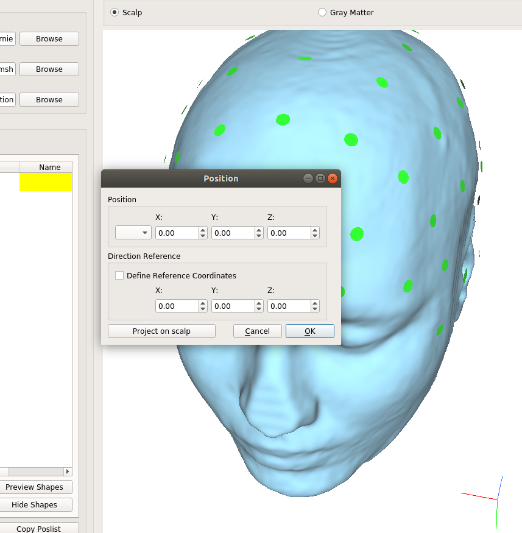

.. _gui_tutorial:

Setting up and Running Simulations
===================================

This tutorial is based on the example data set. Please download it before continue.

Starting the GUI
-----------------
1. Launch the Graphical User Interface (GUI) from the Start Menu (Windows) or by typing on a terminal window

.. code-block:: text

      simnibs_gui

\
  A window such as the following should appear

.. image:: ../images/tutorial_emptygui.png

2. Click on the *Browse* button next to the *Head Mesh* box

.. image:: ../images/tutorial_bowse.png

3. Navigate to the example dataset folder and select the :file:`ernie.msh` file, in the
   example data set

.. image:: ../images/tutorial_selectmsh.png

4. The head mesh will be loaded and the **m2m Folder** and **Output Folder** boxes filled

.. image:: ../images/tutorial_guihead.png

\
  You can change the **Output Folder** by clicking on the *Browse* button close to it, and visualize the gray matter surface by clicking on the *Gray Matter* button above the head model. 

Setting up a tDCS Simulation
-----------------------------
1. Click on *Add tDCS Poslist* at the bottom left of the window

.. image:: ../images/tutorial_addtdcs.png

\
  A new tab will show up.

2. Click on *Add Electrode*

.. image:: ../images/tutorial_addelectrode.png

\
  A new row will be shown in the table

3. Click twice in the *Shape* cell

.. image:: ../images/tutorial_shapecell.png

\
  A new window will open where you can configure the electrode size and shape.

4. Let’s suppose we have a :math:`7.0 \times 5.5 \text{cm}^2` electrode, composed of a single gel layer of 5 mm thickness

.. image:: ../images/tutorial_electrodegui.png

\
  Please refer to the :ref:`GUI documentation <gui_docs>` for a more detailed explanation of this window. You can also copy/paste electrode definitions by right clicking in the shape cell

5. Now double click in the *Position* cell. A new window will appear. You can either select an EEG position from the drop-down menu in the left or click twice in the model to get a position.

\

6. Choose the C3 electrode from the drop-down menu. A black sphere appears in the electrode position, with a green axis indicating the electrode's “y” axis

.. image:: ../images/tutorial_position2.png

\

7. Select the electrode *current* in the first column of the electrode tables. **Positive** values designate **anodes**, and **negative** values **cathodes**. The sum of all current values has to be zero.

.. image:: ../images/tutorial_elcurrent.png

\

8. Now add a second electrode, place it at AF4 and double click on a nearby position to rotate it, aligning the green axis with the top/down direction.

   .. image:: ../images/tutorial_position3.png

\
  Select a shape and a current of -1.000 mA for this second electrode.
  You can see a simple preview of the electrode shapes by clicking on *Preview Shapes* at the bottom of the screen

Setting up a TMS Simulation
----------------------------
1. Click on *Add TMS Poslist* in the bottom of the window. A new TMS tab will be created

   .. image:: ../images/tutorial_addtms.png

\
2. Click on *Browse* and select the *Magstim_70mm_Fig8.nii.gz* coil file

   .. image:: ../images/tutorial_addcoil.png

\
3. Click on *Add Position*

   .. image:: ../images/tutorial_addposition.png

\
4. Double click in the *Position* cell

   .. image:: ../images/tutorial_positioncell.png

\
5. You can select the coil position the same way as an electrode position, or alternatively by double clicking in the head model. In the TMS case, the Y axis where the coil is pointing. Here, we will click on the *Gray Matter* button above the model window and place the coil above the motor cortex, with the green axis pointing anteriorly. This means that the coil handle points posteriorly. :download:`See here for more information on coil coordinates <../data/coil_axesorientation.pdf>` 

   .. image:: ../images/tutorial_coilpos.png

\

6. Additionally, you can also set the dI/dt (the current change ratio) and the coil-skin distance.

7. When using a *.nii.gz* coil file, click on *Show dA/dt field* to see the norm of the primary electric field.

   .. image:: ../images/tutorial_dadt.png

\

.. attention:: This is **NOT the electric field**, but it can be interpreted as a very smooth approximation of it.

Setting Simulation Options
---------------------------
1. Go to *Edit* → *Simulation Options*

   .. image:: ../images/tutorial_simoptions.png

\
  The following window will appear

   .. image:: ../images/tutorial_simoptions2.png

\

2. We can select the *fields* to be output from the simulation

  * **v**: Electrical Potential (Voltage)
  * **vector E**: Electric field vector
  * **norm E**: Norm of the electric field
  * **vector J**: Current density vector
  * **norm J**: Norm of the current density
  * **Conductivities**: Conductivity field. For isotropic conductivities, this is a scalar. For anisotropic conductivities, this is the largest eigenvector of the conductivity tensor.
  * **dA/dt**: Primary field caused by the coil. TMS only. This is a vector field

   Select **vector E** and **norm E**.

3. And the  *Additional Options*

  * **Interpolate to cortical surface**: Interpolates the fields along a surface at the center of the gray matter sheet. Not available for headreco with SPM-only segmentations.
  * **Transform to fsaverage space**: Interpolates to the middle of gray matter and transforms it to FsAverage space. Not available for headreco with SPM-only segmentations.
  * **Interpolate to a nifiti volume**: Interpolates the fields to a nifti volume.
  * **Transform to MNI space**: Interpolates the fields to a nifti volume and applies a transformation to MNI space.

  For the example run, we will select all of the above.

Running a Simulation
---------------------
1. Click on Run at the bottom of the screen

   .. image:: ../images/tutorial_runsim.png

\
2. If there are no errors in the problem set-up, a new window will appear and show the simulation progress. The simulation takes a few minutes, and after finished the bar in the bottom of the window changes from *Teminate* to *Close*.

   .. image:: ../images/tutorial_simrunning.png

\

Now, please go on to our tutorial on :ref:`visualization_tutorial`.

Further Reading
----------------

For more information on the GUI, please see the `SimNIBS 2.1 tutorial paper <https://doi.org/10.1101/500314>`_.
