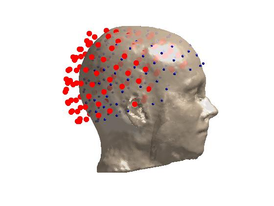
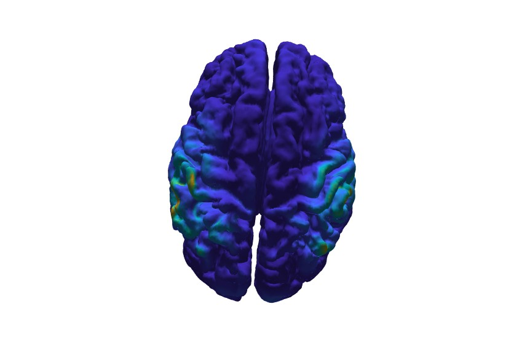
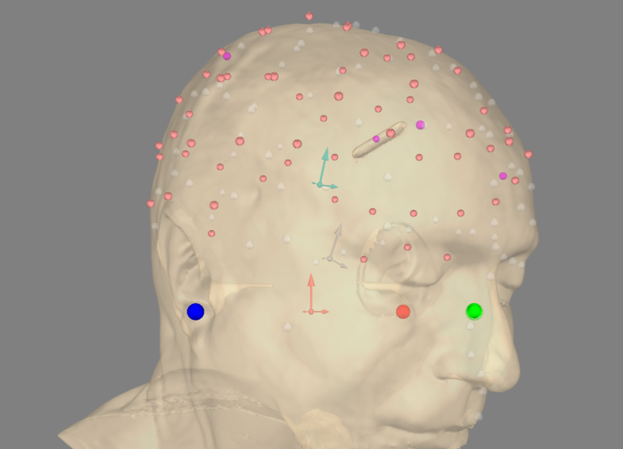
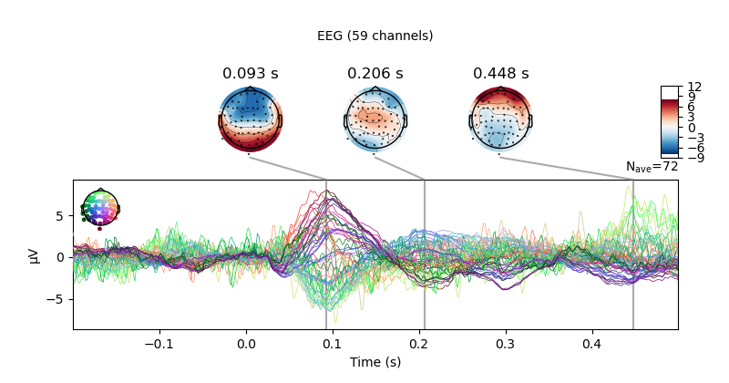
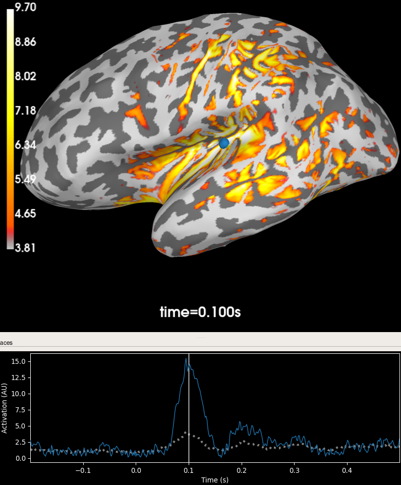

.. _eeg_leadfields:

Calculation of EEG Leadfields
=============================

.. note:: When using this feature in a publication, please cite `Nielsen JD, Puonti O, Xue R, Thielscher A, Madsen KH (2023) Evaluating the influence of anatomical accuracy and electrode positions on EEG forward solutions. Neuroimage, 277:120259. <https://doi.org/10.1016/j.neuroimage.2023.120259>`_

Currently, we support exporting leadfields for FieldTrip (MATLAB) and MNE-Python (python).

The general procedure for creating leadfields for electroencephalography (EEG) from a headmodel generated with SimNIBS includes the following steps

1. Run CHARM on the subject to create the anatomical model of the head. This creates the directory `m2m_[subid]`. Please see :ref:`head_modeling_tutorial` for a more thorough description of this step.

2. Prepare EEG montage (electrode locations). In order to compute the leadfield, we need to place the EEG electrodes on our head model. This step transforms the electrode location information from FieldTrip or MNE-Python to SimNIBS and as such requires that you have electrode locations defined for your subject. This could be from digitizing the electrodes during an experiment or from warping a template to fit the subject. Therefore, we will use our software of choice (FieldTrip or MNE-Python) to compute a transformation that registers the EEG electrodes to subject MRI space and use ``prepare_eeg_montage`` to save these in a format that SimNIBS understands.

3. Prepare the TDCS leadfield. This step combines the data from step 1 and 2 to compute a TDCS leadfield. ``prepare_tdcs_leadfield`` is provided as a convenience function to run a TDCS leadfield simulation which forms the basis for the EEG forward solution computed by SimNIBS. This will compute the electric field and interpolate it to the central gray matter surface. By default, electrodes are modeled as points (projected onto the skin surface). Alternatively, electrodes can be modelled as circular with diameter of 10 mm and a thickness of 4 mm and meshed onto the head model. Default conductivities will be used. For more control, use the python function ``simnibs.eeg.forward.compute_tdcs_leadfield`` or define the simulation from scratch using ``simnibs.simulation.sim_struct.TDCSLEADFIELD``.

4. Finally, we use ``prepare_eeg_forward`` to prepare the TDCS leadfield for EEG inverse calculations. This will also write the source space definition and (optionally) a "morpher" (i.e., a sparse matrix) mapping from subject space to fsaverage space.

FieldTrip
---------
We will use the data from `this <https://www.fieldtriptoolbox.org/workshop/natmeg2014/dipolefitting>`_ FieldTrip tutorial. Download the `mri data <https://download.fieldtriptoolbox.org/workshop/natmeg2014/dicom.zip>`_ and the `EEG data <https://download.fieldtriptoolbox.org/workshop/natmeg2014/oddball1_mc_downsampled.fif>`_ to the same directory. Extract the DICOM data. In MATLAB, we will assume that you are in this directory when executing the commands. Let us start by converting the MR image to NIfTI.

.. code-block:: matlab

    ft_defaults;

    % convert dicom to nifti
    mri = ft_read_mri(fullfile('dicom', '00000113.dcm'));
    ft_write_mri('mri.nii.gz', mri.anatomy, 'transform', mri.transform , 'dataformat', 'nifti');

Then run CHARM to obtain the head model (mesh).

.. code-block:: console

    charm sub mri.nii.gz

This will create ``m2m_sub``.

.. attention:: As you can see, mri.nii.gz is not ideal for making an accurate headmodel, however, it is OK for demonstration purposes.

Next, align electrodes with the MR image.

.. code-block:: matlab

    dataset = 'oddball1_mc_downsampled.fif';

    elec = ft_read_sens(dataset, 'senstype', 'eeg');
    elec = ft_convert_units(elec, 'mm');

    % The dataset contains fiducials, however, I was not able to compute a
    % good electrode-MRI registration using these

    % shape   = ft_read_headshape(dataset, 'unit', 'cm');
    % shape = ft_convert_units(shape, 'mm');

    % Therefore, we will use the below transformation which I estimated
    % interactively using `ft_electroderealign to align the electrodes
    % and the MR image
    head_to_mri_trans = [
        [1.0000    0         0         0];
        [0    1.0000         0   30.0000];
        [0         0    1.0000         0];
        [0         0         0    1.0000]
    ];

    elec_mri = ft_transform_geometry(head_to_mri_trans, elec);

    % Let us check the alignment

    mesh = ft_read_headshape('m2m_sub/sub.msh');

    figure;
    hold on;
    ft_plot_mesh(mesh, 'surfaceonly', 'yes', 'vertexcolor', 'none', ...
        'edgecolor', 'none', 'facecolor', 'skin', 'facealpha', 0.8);
    camlight;
    ft_plot_sens(elec, 'style', 'r');
    ft_plot_sens(elec_mri, 'elecshape', 'sphere');
    view([1 0 0]);

    % Finally, save the transformed electrode positions
    elec = elec_mri;
    save('elec.mat', 'elec');

    Coregistration result. Red is before transformation; blue is after.

Convert this to the format that SimNIBS uses for electrode positions

.. code-block:: console

    prepare_eeg_montage fieldtrip eeg_montage.csv elec.mat

This will create `eeg_montage.csv` which should contain the positions of the electrodes *in subject MRI space*. Now, compute the TDCS leadfield (subsample each hemisphere to 40,000 vertices).

.. code-block:: console

    prepare_tdcs_leadfield sub eeg_montage.csv -o fem_sub -s 40000

Finally, prepare it for EEG.

.. code-block:: console

    prepare_eeg_forward fieldtrip sub fem_sub/sub_leadfield_eeg_montage.hdf5 --fsaverage 40

We should now have the following files in the `fem_sub` directory

.. code-block:: console

    sub_leadfield_eeg_montage-40000-fwd.mat
    sub_leadfield_eeg_montage-40000-morph.mat
    sub_leadfield_eeg_montage-40000-src.mat

which can be used for source analysis with FieldTrip.

First, we process the EEG data as it is done `here <https://www.fieldtriptoolbox.org/workshop/natmeg2014/dipolefitting/#process-the-eeg-data>`_. (Note, that you need to download and put `this <https://download.fieldtriptoolbox.org/workshop/natmeg2014/trialfun_oddball_stimlocked.m>`_ file in your MATLAB path.) `ft_rejectvisual` will open a window where you can select bad trials based on variance.

.. code-block:: matlab

    % Read EEG data, segment, and preprocess
    cfg = [];
    cfg.dataset = dataset;
    cfg.trialdef.prestim        = 0.2;
    cfg.trialdef.poststim       = 0.4;
    cfg.trialdef.rsp_triggers   = [256 4096];
    cfg.trialdef.stim_triggers  = [1 2];
    cfg.trialfun                = 'trialfun_oddball_stimlocked';

    cfg = ft_definetrial(cfg);

    cfg.continuous    = 'yes';
    cfg.hpfilter      = 'no';
    cfg.detrend       = 'no';
    cfg.demean        = 'yes';
    cfg.baselinewindow = [-inf 0];
    cfg.dftfilter     = 'yes';
    cfg.dftfreq       = [50 100];
    cfg.lpfilter      = 'yes';
    cfg.lpfreq        = 120;
    cfg.channel       = 'EEG';
    cfg.precision     = 'single';

    data_eeg = ft_preprocessing(cfg);

    % Remove bad trials

    cfg = [];
    cfg.method = 'summary';
    cfg.keepchannel = 'no';
    cfg.preproc.reref = 'yes';
    cfg.preproc.refchannel = 'all';
    data_eeg_clean = ft_rejectvisual(cfg, data_eeg);

    % Apply an average reference

    cfg = [];
    cfg.reref = 'yes';
    cfg.refchannel = 'all';
    data_eeg_reref = ft_preprocessing(cfg, data_eeg_clean);

    % Compute evoked response

    % Evoked response incl. source covariance matrix
    cfg = [];
    cfg.covariance = 'yes';
    cfg.covariancewindow = [0.08, 0.11];
    timelock_eeg_all = ft_timelockanalysis(cfg, data_eeg_reref);

    % cfg.trials = find(data_eeg_reref.trialinfo==1);
    % timelock_eeg_std = ft_timelockanalysis(cfg, data_eeg_reref);
    % cfg.trials = find(data_eeg_reref.trialinfo==2);
    % timelock_eeg_dev = ft_timelockanalysis(cfg, data_eeg_reref);

    % Compute noise covariance matrix
    cfg = [];
    cfg.covariance = 'yes';
    cfg.covariancewindow = [-0.2, 0.0];
    timelock_eeg_noise = ft_timelockanalysis(cfg, data_eeg_reref);

Contrary to the FieldTrip tutorial, we will not be fitting (two symmetric) dipoles as we cannot use the symmetry constraint with a leadfield from SimNIBS - and fitting a single dipole to this data probably does not make sense as the auditory stimulation is binaural. Instead, we will compute a minimum norm (distributed) source estimate.

.. note:: There are a few limitations on dipole estimates in FieldTrip when using a (precomputed) leadfield from SimNIBS. For example, the symmetry constraint and the nonlinear parameter search cannot be used as FieldTrip is not able to sample the leadfield at arbitrary locations (although, technically, this `is` possible, it is not currently supported).

.. code-block:: matlab

    load fem_sub/sub_leadfield_eeg_montage_subsampling-40000-fwd.mat
    load fem_sub/sub_leadfield_eeg_montage_subsampling-40000-src.mat

    fwd.tri = src.tri;

    cfg               = [];
    cfg.method        = 'mne';
    cfg.sourcemodel   = fwd;
    cfg.mne.prewhiten = 'yes';
    cfg.mne.lambda    = 3;
    cfg.mne.scalesourcecov = 'yes';
    cfg.mne.noisecov = timelock_eeg_noise.cov;
    source = ft_sourceanalysis(cfg, timelock_eeg_all);

Plot the estimated source power at 0.1 s after the presentation of the stimulus.

.. code-block:: matlab

    % the 76th time point correspondings to 0.1 s post simulus
    m = source.avg.pow(:, 76);

    figure;
    ft_plot_mesh(source, 'vertexcolor', m);
    view([0 90]);
    h = light;
    set(h, 'position', [0 1 0.2]);
    lighting gouraud;
    material dull;

    Minimum norm source estimate.

This is not perfect but it seems to align reasonably well with the symmetric dipole estimate from `this <https://www.fieldtriptoolbox.org/workshop/natmeg2014/dipolefitting/#compare-the-eeg-and-meg-dipole-fits>`_ section of the original FieldTrip tutorial.

MNE-Python
----------

.. attention:: Currently, exporting forward solutions to MNE-Python is only compatible with MNE-Python <= 1.5.

First, make sure MNE-Python is installed in the same environment as SimNIBS. If you used the installer, you can call ``simnibs_python``

.. code-block:: console

    simnibs_python -m pip install mne==1.5 h5io scikit-learn pyvistaqt

otherwise, ensure you are using the appropriate python interpreter and simply use ``python`` instead of ``simnibs_python`` (if you are using ``conda`` you can of course also install MNE-Python that way!). A miminal check that everything is working is ``simnibs_python -c "import mne, simnibs; print('OK')"``.

Next, download MNE-Python's example data. We will use the data of the subject called `sample`. We start by converting the MRI `T1.mgz` to NIfTI (please set the correct path to the MNE example data).

.. code-block:: python

    from pathlib import Path

    import nibabel as nib
    import matplotlib.pyplot as plt
    import numpy as np

    import mne
    from mne.coreg import Coregistration
    from mne.io import read_info

    mne_data_path = Path("/path/to/mne_data")

    # this should download the data if not already present
    data_path = mne.datasets.sample.data_path(mne_data_path)
    subjects_dir = data_path / "subjects"
    subject = "sample"

    img = nib.load(subjects_dir / subject / "mri" / "T1.mgz")
    nii = nib.Nifti1Image(img.get_fdata().astype(img.get_data_dtype()), img.affine)
    # sets qform code to 2 which is fine
    nii.set_qform(nii.affine)
    nii.set_sform(nii.affine)
    nii.to_filename("T1.nii.gz")

Then run CHARM. We use the ``--fs-dir`` option which grabs the cortical surfaces from a FreeSurfer run rather than estimate them as part of CHARM.

.. code-block:: console

    charm sample T1.nii.gz --forceqform --fs-dir /path/to/MNE-sample-data/subjects/sample

Perform coregistration using MNE-Python.

.. code-block:: python

    # This code is modified from the following MNE-Python tutorial on coregistration
    # https://mne.tools/1.5/auto_tutorials/forward/25_automated_coreg.html

    data_path = mne.datasets.sample.data_path(mne_data_path)
    # data_path and all paths built from it are pathlib.Path objects
    subjects_dir = data_path / "subjects"
    subject = "sample"

    fname_raw = data_path / "MEG" / subject / f"{subject}_audvis_raw.fif"
    info = read_info(fname_raw)

    eeg_indices = mne.pick_types(info, meg=False, eeg=True)
    info = mne.pick_info(info, eeg_indices)

    fiducials = "estimated"  # get fiducials from fsaverage
    coreg = Coregistration(info, subject, subjects_dir, fiducials=fiducials)
    coreg.fit_fiducials(verbose=True)
    coreg.omit_head_shape_points(distance=5.0 / 1000)  # distance is in meters
    coreg.fit_icp(n_iterations=20, nasion_weight=10.0, verbose=True)

    dists = coreg.compute_dig_mri_distances() * 1e3  # in mm
    print(
        f"Distance between HSP and MRI (mean/min/max):\n{np.mean(dists):.2f} mm "
        f"/ {np.min(dists):.2f} mm / {np.max(dists):.2f} mm"
    )

    # save the updated info object, i.e., containing only EEG electrodes
    mne.io.write_info("info.fif", info)

    _, _, mri_ras_t, _, _ = mne._freesurfer._read_mri_info(subjects_dir / subject / "mri" / "T1.mgz")
    trans = mne.transforms.combine_transforms(coreg.trans, mri_ras_t, coreg.trans["from"], mri_ras_t["to"])

    # The transformation is actually head <-> RAS but MNE-Python expects
    # head <-> MRI (FreeSurfer surface RAS)
    trans["to"] = coreg.trans["to"]

    mne.write_trans('head_ras-trans.fif', trans)

Check the coregistration

.. code-block:: python

    plot_kwargs = dict(
        subject=subject,
        subjects_dir=subjects_dir,
        surfaces="head-dense",
        dig=True,
        eeg="original",
        meg=False,
        show_axes=True,
        coord_frame="head",
    )
    view_kwargs = dict(azimuth=45, elevation=90, distance=0.6, focalpoint=(0.0, 0.0, 0.0))

    fig = mne.viz.plot_alignment(info, trans=coreg.trans, **plot_kwargs)
    mne.viz.set_3d_view(fig, **view_kwargs)

    Coregistration result. Please note that what is visualized here is actually the electrodes transformed to FreeSurfer's surface RAS space.

Convert the electrode location information to a format that SimNIBS understands (remember to insert correct paths).

.. code-block:: console

    prepare_eeg_montage mne eeg_montage.csv info.fif head_ras-trans.fif

This will create `eeg_montage.csv` which should contain the positions of the electrodes *in subject MRI space*.

Now, compute the TDCS leadfield.

.. code-block:: console

    prepare_tdcs_leadfield sample eeg_montage.csv -o fem_sample

Finally, prepare it for EEG.

.. code-block:: console

    prepare_eeg_forward mne sample fem_sample/sample_leadfield_eeg_montage.hdf5 info.fif head_ras-trans.fif --fsaverage 160

We should now have the following files in the `fem_sample` directory

.. code-block:: console
    :caption: MNE-Python

    sample_leadfield_eeg_montage-fwd.fif
    sample_leadfield_eeg_montage-morph.h5
    sample_leadfield_eeg_montage-src.fif

for MNE-Python.

Source Analysis
^^^^^^^^^^^^^^^

Now, use the forward model that we just created to do source location with MNE-Python. The following is adapted from `this <https://mne.tools/1.5/auto_tutorials/inverse/70_eeg_mri_coords.html>`_ tutorial to use EEG data and the forward model from SimNIBS.

.. code-block:: python

    fname_raw = data_path / "MEG" / "sample" / "sample_audvis_raw.fif"

    raw = mne.io.read_raw_fif(fname_raw)
    raw.pick_types(meg=False, eeg=True, stim=True, exclude=()).load_data()
    raw.set_eeg_reference(projection=True)

    events = mne.find_events(raw)
    epochs = mne.Epochs(raw, events)
    cov = mne.compute_covariance(epochs, tmax=0.0)
    evoked = epochs["1"].average()  # trigger 1 in auditory/left
    evoked.plot_joint()

    Evoked response with topo-plots.

Read forward solution, make inverse operator, and apply it.

.. code-block:: python

    # Read forward solution created with SimNIBS
    fname_fwd = "fem_sample/sample_leadfield_eeg_montage-fwd.fif"
    fwd = mne.read_forward_solution(fname_fwd)

    method = "dSPM"

    inv = mne.minimum_norm.make_inverse_operator(evoked.info, fwd, cov, verbose=True)
    stc, residual = mne.minimum_norm.apply_inverse(evoked, inv, method=method, return_residual=True)

    fig, ax = plt.subplots()
    ax.plot(1e3 * stc.times, stc.data[::100, :].T)
    ax.set(xlabel="time (ms)", ylabel="%s value" % method)
    fig.show()

    residual.plot()

.. figure:: ../../images/tutorial_eeg/mne/source_time.png

    Time course of source estimates.

.. figure:: ../../images/tutorial_eeg/mne/evoked_residual.png

    Residual of evoked response.

Plot the source time course and location. Note that this plot only works because we used ``--fs-dir`` with CHARM! Otherwise, the FreeSurfer and CHARM surfaces would differ and this function uses the FreeSurfer surfaces for plotting.

.. code-block:: python

    brain = stc.plot(subjects_dir=subjects_dir, initial_time=0.1)

    Source activation plottet on brain.

References
----------
`Nielsen JD, Puonti O, Xue R, Thielscher A, Madsen KH (2023) Evaluating the influence of anatomical accuracy and electrode positions on EEG forward solutions. Neuroimage, 277:120259. <https://doi.org/10.1016/j.neuroimage.2023.120259>`_
