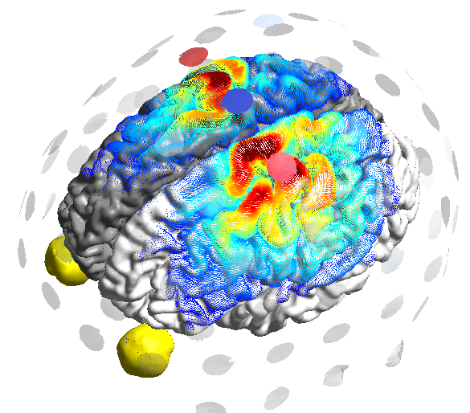
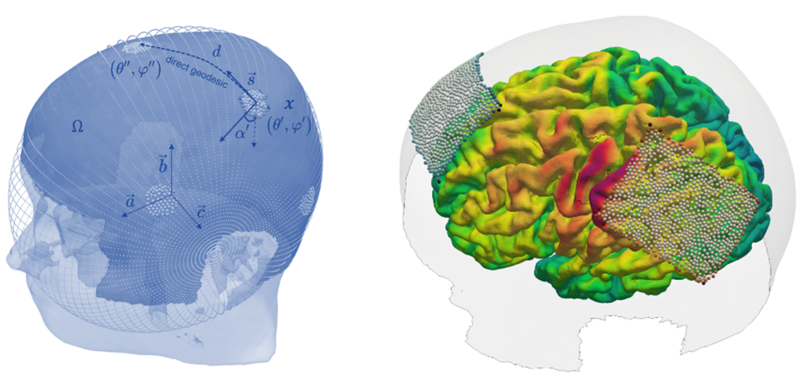

.. _overview_tes_opt:

TES Optimization
================

SimNIBS supports a few complementary methods to optimize TES montages. 

   
Leadfield-based approaches
--------------------------

* :ref:`tdcs_opt` for the stimulation of one or more circumscribed brain areas
* :ref:`tdcs_distributed_opt`

These methods require predefined electrode positions (i.e., a EEG cap layout). They determine the best combination of currents through those electrodes to optimally stimulate a given target brain area. The optimization can be subject to a number of constraints, such as limiting the total injected current strength or the number of active electrodes. These methods are best suited for multichannel stimulation devices. They require the precalculation of *lead fields*, i.e. the fields caused by each electrode individually, keeping a constant return electrode. 

.. toctree::
   :hidden:

   tdcs_opt
   tdcs_distributed_opt
   tes_flex_opt

   
Leadfield-free approach
-----------------------

* :ref:`tes_flex_opt`

This method allows the electrodes to move freely on the head surface during optimization. It is best suited for a low to moderate number of electrodes. It is very flexible and can handle montages with rectangular electrodes, center-surround montages, temporal interference stimulation and electrode arrays for tumor treating field therapies.

