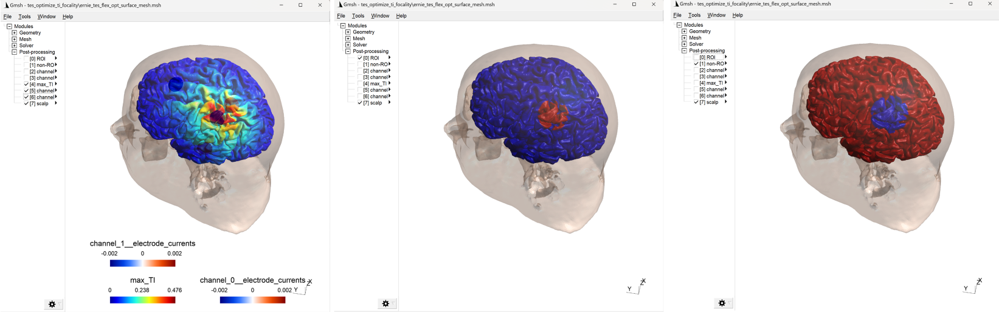
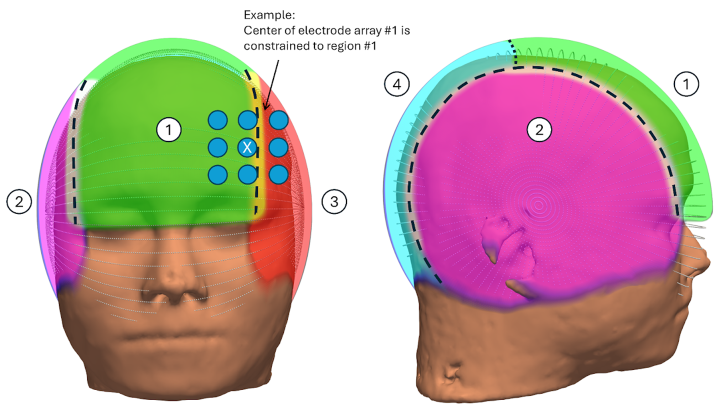

.. _tes_flex_opt:

Leadfield-free TES Optimization
===============================

.. note:: When using this feature in a publication, please cite `Weise K, Madsen KH, Worbs T, Knösche TR, Korshøj A, Thielscher A, A Leadfield-Free Optimization Framework for Transcranially Applied Electric Currents, bioRxiv 10.1101/2024.12.18.629095 <https://www.biorxiv.org/content/10.1101/2024.12.18.629095v1>`_

\

Introduction
--------------
The leadfield-free TES optimization supports standard 2-channel TES, focal center-surround Nx1 TES, TI stimulation and Tumor Treating Fields (TTF). Several quantities of interest (QoI) are supported, including:

* for TES: Electric field magnitude ("magn") and its normal component relative to the cortex orientation ("normal")
* for TIS: maximal envelope of TI field magnitude ("max_TI") and envelope of the normal component of the TI field ("dir_TI_normal")
* for TTF: Electric field magnitude ("magn"), whereby the field magnitudes of the two array pairs will be averaged

The following optimization goals are available:

* Maximize the QoI in a region-of-interest
* Optimize the intensity-focality tradeoff between the QoI in the region-of-interest and the QoI in an avoidance region (e.g. the rest of the brain)
* Maximize the intensity of the QoI in the region-of-interest, while making the field as *unfocal* as possible. This can be relevant for TTF, where the aim is to focus the treatment on a tumor region, while maintaing high intensities throughout the brain (as the cancer cells might already have infiltrated further regions).

Example 1: Optimizing the electric field magnitude for 2-channel TES
--------------------------------------------------------------------
This example maximizes the electric field strength in a ROI around the left hand knob.

* *Python*

  .. literalinclude:: ../../simnibs/examples/tes_flex_optimization/tes_flex_tes_intensity.py
     :language: python

\

* *MATLAB*

  .. literalinclude:: ../../simnibs/examples/tes_flex_optimization/tes_flex_tes_intensity.m
     :language: matlab

\

The optimization will create the Gmsh output file :file:`ernie_tes_flex_opt_surface_mesh.msh` with the ROI, the optimized field and the electrode positions. The optimized electrode positions are listed in the *summary.txt*. In addition, the results folder contains visualizations (electrode_channel...png) for control of the electrode array layouts.

.. figure:: ../images/tes_intensity_opt.png
   :scale: 40 %

Example 2: Optimizing the focality of TI stimulation
----------------------------------------------------
This example optimizes the intensity - focality tradeoff of TIS, focused on the left hand knob. 
This requires the defintion of two regions: The first will be used as target ROI, the second will be the avoidance area (or "non-ROI). In addition, two thresholds are defined - the optimization goal is to ensure that the QoI (here: *maxTI*) is lower than the first threshold in the avoidance region, while it exceeds the second threshold in the ROI.

* *Python*

  .. literalinclude:: ../../simnibs/examples/tes_flex_optimization/tes_flex_ti_focality.py
     :language: python

\

* *MATLAB*

  .. literalinclude:: ../../simnibs/examples/tes_flex_optimization/tes_flex_ti_focality.m
     :language: matlab

\

The optimization will create the Gmsh output file :file:`ernie_tes_flex_opt_surface_mesh.msh` with the optimized field, electrode positions, ROI, and avoidance region. The optimized electrode positions are listed in the *summary.txt*. In addition, the results folder contains visualizations (electrode_channel...png) for control of the electrode array layouts.

Notes
--------------
* The optimization uses the MKL Pardiso direct solver for accelerating the simulations. The SimNIBS standard FEM solver can be chosen optionally to reduce memory consumption, but will also substantially slow down the optimization.
* 32GB main memory are recommended, even thougth some optimizations will run with 16GB main memory.
* Optimization is performed using the differential evolution algorithm, which is stochastic in nature. As such, solutions will differ between repeated optimization runs, even though the achieved final cost will be very close to each other.
* For TTF, we recommend setting *constrain_electrode_locations* to True, which will restrict the locations for each of the four electrode arrays to frontal, left and right parietal, and occipital. This speeds up the search by reducing the likelihood for overlapping configurations. The restriction is applied to the centers of the arrays, so that half of an array can still move into the neighboring skin areas, keeping sufficient flexibility for the optimization.

* Please see :ref:`tes_flex_opt_doc` for a description of the option settings, :ref:`regionofinterest_doc` for a description of the region-of-interest parameters, and :ref:`electrode_layouts` for a description of the electrode array layout parameters.

